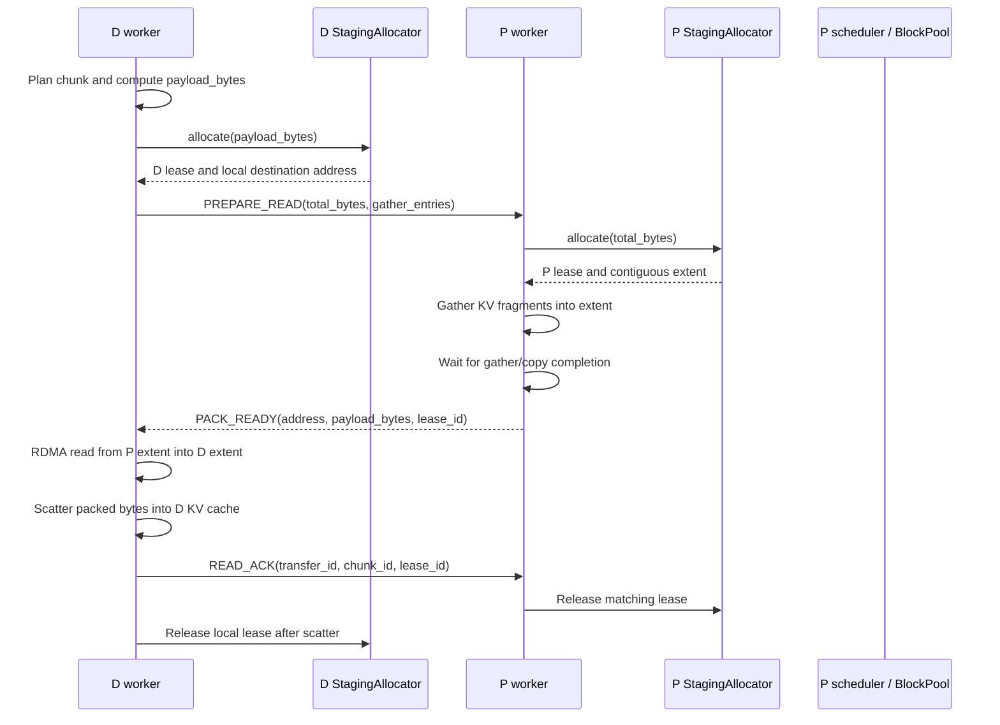
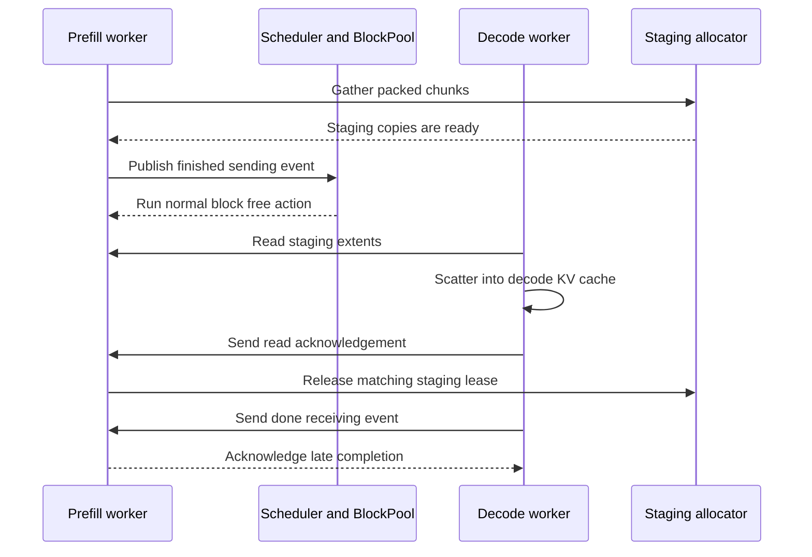

# Mooncake Staging Allocator

This document describes the page-based allocator used by Mooncake packed KV
transfers. Each worker owns one bounded HBM arena registered with its Transfer
Engine. Concurrent chunks allocate extents from that arena according to their
payload size. The former fixed-capacity slot pool has been removed.

## Allocation Flow

P and D workers allocate independently. The P extent is the remote RDMA source
in READ mode; the D extent is the local RDMA destination. WRITE mode reverses
which side receives the allocation request.



For WRITE mode, P gathers into a local extent, asks D to allocate its
destination extent, performs RDMA WRITE, then sends `WRITE_DONE` with D's
`lease_id`. D scatters and releases the matching lease.

## Arena and Lease Model

The allocator registers one contiguous, aligned arena and subdivides it into
page-aligned extents. First-fit allocation rounds each payload up to whole
pages. Releasing a lease coalesces adjacent free extents. An individual
allocation wastes less than one page internally, while arena fragmentation
can still prevent a large contiguous allocation even when total free bytes
would otherwise suffice.

```text
Registered HBM arena
low address                                                   high address
┌──────────────┬──────────────────┬────────────┬──────────────────┐
│ free extents │ chunk A: 6 pages │ free pages │ chunk B: 8 pages │
│              │ 1.5 MiB payload  │            │ 2.0 MiB payload  │
└──────────────┴──────────────────┴────────────┴──────────────────┘

Adjacent free extents merge when their leases are released.
```

Each lease carries a monotonically increasing `lease_id`, byte offset,
payload length, allocated page count, and allocated length. READ ACK and
WRITE DONE must match the active transfer, chunk, and lease before an extent
can be released. Duplicate prepare messages for an active transfer/chunk
reuse the outstanding lease; stale or duplicate releases are rejected or
treated as idempotent by the service.

Allocator locks protect extent metadata only. Gather, RDMA, and scatter run
outside the allocator lock. The arena is bounded HBM reserved for the
worker's lifetime; page allocation shares this budget among active chunks but
does not return the arena to the device after each transfer.

## Failure and Lifetime Rules

If no contiguous extent is available, allocation fails and the transfer is
reported as failed. The configured maximum number of chunks bounds the
concurrent P gather executor and the D READ batch window. This first
implementation does not add a retry queue or a timeout-based forced release.

A lease ID prevents an old ACK from freeing a newer extent. It does not stop
an already-issued DMA from writing to an extent. Therefore a worker must not
reclaim a lease after an uncertain timeout unless the Transfer Engine has
confirmed the operation is quiescent or the engine/worker has been reset.
Worker termination releases the process-owned arena; recovery from a lost
worker is handled by the existing connector lifecycle.

## P-Side KV Block Lifetime

For a request whose plan consists entirely of packed staging chunks, each
source KV range has an independent copy in a P-side staging extent as soon as
its gather finishes. Once the last packed chunk has finished gathering, the P
side publishes the same `finished_sending(request_id)` event normally produced
by `DONE_RECVING`. The existing scheduler then runs its normal
`kv_cache_manager.free(request)` action, including BlockPool/reference-count
accounting. The staging service does not call BlockPool directly and does not
invent a second release path.



The early completion callback is enabled only when `direct_runs` is empty and
there is at least one `packed_chunk`. This matters for small prompts, where
most or all source blocks can be copied into staging: an all-staging request
can return its source blocks immediately after the final gather instead of
waiting for D to finish its read. A mixed plan still has direct RDMA reads from
the source KV cache, so it waits for the original request-level
`DONE_RECVING` path.

`DONE_RECVING` is still sent by D after its receive/scatter work. It remains
needed for remote task and port cleanup and is consumed idempotently after an
early completion; it is no longer the prerequisite for freeing source blocks
in the all-staging case. `READ_ACK` remains mandatory because it protects the
staging lease itself: P must not reuse or overwrite that extent until D has
finished the RDMA read and scatter.

The completion state is tracked per request and per transfer. The final gather
callback fires once after all expected packed chunks have been observed;
duplicate prepare messages do not fire it again. Failed or incomplete gathers
do not trigger early completion. If the scheduler has already force-freed or
otherwise removed a request, a late gather callback is ignored.

## Configuration

All values are per worker. Capacity bounds the arena, page size controls
extent rounding, chunk capacity limits planner output, and maximum concurrent
chunks bounds the gather executor and D READ batch window.

| Environment variable | Default | Meaning |
| --- | ---: | --- |
| `VLLM_ASCEND_STAGING_ENABLED` | `0` | Enable the staging transfer path. |
| `VLLM_ASCEND_STAGING_CAPACITY_MIB` | `32` | Total HBM arena capacity per worker. |
| `VLLM_ASCEND_STAGING_PAGE_SIZE_KIB` | `256` | Page size in KiB; must be a positive power of two. |
| `VLLM_ASCEND_STAGING_CHUNK_CAPACITY_MIB` | `16` | Maximum packed chunk payload. Must not exceed arena capacity. |
| `VLLM_ASCEND_STAGING_MAX_CONCURRENT_CHUNKS` | `2` | Maximum chunks in the gather executor / D READ window. |
| `VLLM_ASCEND_STAGING_MIN_DIRECT_SIZE` | `1048576` | Entry threshold in bytes for direct transfer versus staging. |
| `VLLM_ASCEND_STAGING_V1_MAX_PROMPT_TOKENS` | `8192` | MooncakeConnectorV1 uses staging when `prompt_len <=` this value. Longer prompts use direct RDMA. `0` disables the length filter. A transfer also bypasses staging when packed bytes exceed allocator capacity. |

Arena allocation uses a 2 MiB base alignment by default, with the configured
page size as the extent granularity. Validate these settings against the
supported NPU and Transfer Engine address/length constraints before
deployment.

## Baseline Performance Test Procedure

This procedure adapts the `580` business-request stage from
`/Users/szza/codespace/work/docs/handoff-bench-overnight-20260924/README.md`
to the `baseline` deployment in namespace `glm53-qiuwu`. It runs the client
on `dev-mac`, where `/sharedata/szza` is shared with the Pods. Scripts and
results therefore survive Pod restarts. The procedure sends requests to the
existing service; it does not deploy changes or restart Pods.

### Workload and Preconditions

| Setting | Baseline value |
| --- | --- |
| Deployment | One P instance and one D instance; P TP16, D DP16/TP1 |
| Client | `ssh dev-mac`, `/usr/bin/python3` (3.10.12 in the recorded run) |
| Endpoint | P Pod IP, port `9080`, `/v1/chat/completions` |
| Fixtures | `/sharedata/llx/cm384-glm53/infrastructure/cluster-benchmark-v1/business-fixtures-v3/business-reuse-c192-v2` |
| Workload | 290 users, two turns each, 580 requests |
| Scheduling | `--schedule session --cache reuse --concurrency 96` |
| Request timeout | 1800 seconds in the handoff copy of the script |
| Metrics collection | `GOLD16_METRICS=off` |
| Normalization | `BENCH_NODES=2` for this 1P1D deployment |

Each user sends turn 0, waits a deterministic random 1-5 seconds, then sends
turn 1 with the same `cache_salt`. Concurrency 96 bounds concurrent user
sessions. Use the fixture's original request body, including `max_tokens`
and thinking settings. The script adds the salt and streaming usage options.
The directory contains 580 request fixtures plus `manifest.json`.

Before each run, check Pod readiness and resolve the current P IP on the Mac:

```bash
export KUBECONFIG="$HOME/.kube/config.grape-lab"
kubectl -n glm53-qiuwu get pods -o wide
P_IP=$(kubectl -n glm53-qiuwu get pod \
  glm53-1p1d-baseline-0-prefill-0-0 -o jsonpath='{.status.podIP}')
printf 'Baseline API: http://%s:9080\n' "$P_IP"
```

Wait for both baseline Pods to be Ready and for the service to have no active
benchmark traffic. Check the proxy health from `dev-mac`, using the resolved
IP (the recorded run used `192.168.190.177`):

```bash
ssh dev-mac
export GOLD16_API=http://192.168.190.177:9080
curl --fail --silent --show-error "$GOLD16_API/health"
```

The recorded health response was
`{"status":"ok","prefill_instances":1,"decode_instances":16,"request_num":0}`.
Health is a readiness check; benchmark acceptance comes from request results.
Run benchmarks serially to avoid mixing their latency and throughput.

Record the deployed environment, connector configuration, image/code
version, and Pod start times with the results. Updating shared source files
does not prove an already-running worker has loaded that code. Use the
deployment instructions in
`/Users/szza/codespace/work/glm52-w4a8c8/patches/packed_kv_staging/DEPLOYMENT.md`
when a separate deployment is needed before benchmarking.

### Copy All Handoff Scripts

Run these commands on the Mac. Copy the complete script directory, so the
report generator and other workload scripts are available for later reuse:

```bash
ssh dev-mac 'mkdir -p /sharedata/szza/handoff-bench-overnight-20260924/scripts'
scp /Users/szza/codespace/work/docs/handoff-bench-overnight-20260924/scripts/* \
  dev-mac:/sharedata/szza/handoff-bench-overnight-20260924/scripts/
```

The directory contains `append_report.py`, `campaign.sh`,
`chat_provider_zice.py`, `run_llx_business_lowc.py`,
`run_multiturn_c8_router.py`, and `run_multiturn_u96_64k_16x1k.py`.
For this baseline test, invoke `run_llx_business_lowc.py` directly;
`campaign.sh` is configured for the original multi-service gateway campaign.

### Execute One 580/C96 Run

Run in a persistent terminal on `dev-mac`. Set `GOLD16_API` to the current P
IP found above. Use a new run tag and output directory for every independent
run; the script creates the output directory and refuses an existing one.
A fresh tag also separates cache salts from previous benchmark runs.

```bash
ssh dev-mac
set -o pipefail
export GOLD16_API=http://192.168.190.177:9080
export GOLD16_METRICS=off
export API_KEY=""
export GOLD16_API_KEY=""
export BENCH_NODES=2
export RUN_TAG="baseline-580-c96-$(date +%Y%m%d-%H%M%S)"
export BENCH_ROOT="/sharedata/szza/benchmark/$RUN_TAG"
export ABORT_FILE="$BENCH_ROOT/abort"
mkdir -p /sharedata/szza/benchmark
/usr/bin/python3 -u \
  /sharedata/szza/handoff-bench-overnight-20260924/scripts/run_llx_business_lowc.py \
  --concurrency 96 --schedule session --cache reuse --outdir "$BENCH_ROOT" \
  2>&1 | tee "$BENCH_ROOT.log"
```

The direct baseline endpoint used here required no API key. For an endpoint
that requires authentication, supply credentials through the environment
without recording them in documentation or logs.

To stop a run, create its abort file from another `dev-mac` terminal:

```bash
touch "/sharedata/szza/benchmark/<run-tag>/abort"
```

This requests a client stop. Active connections may still need to receive
data or reach their timeout before the client exits. Preserve incomplete
results and the client log as a failed/incomplete run.

### Validate and Summarize Results

| File | Contents |
| --- | --- |
| `summary.json` | Acceptance flag, usage-bearing request count, latency and token totals |
| `rows.json` | Per-request usage, finish reason, timing, user/turn and salt; no answer text |
| `events.jsonl` | Client start, progress, exception and completion events |
| `errors.json` | Exceptions recognized by the client |
| `metrics-before.json`, `metrics-after.json` | Skipped metrics markers when metrics are off |
| `<run-tag>.log` | Client standard output and error, beside the output directory |

Inspect a completed run on `dev-mac`:

```bash
export BENCH_ROOT="/sharedata/szza/benchmark/<run-tag>"
/usr/bin/python3 - "$BENCH_ROOT" <<'PY'
import json
import sys
from pathlib import Path

root = Path(sys.argv[1])
summary = json.loads((root / "summary.json").read_text())
rows = json.loads((root / "rows.json").read_text())
missing = [row for row in rows if not row.get("usage")]
print(json.dumps(summary, indent=2))
print(f"Recorded: {len(rows)}/580; missing usage: {len(missing)}")
for row in missing[:5]:
    print({key: row.get(key) for key in
           ("user", "turn", "elapsed_s", "ttft_s", "finish", "out_chars")})
PY
/usr/bin/python3 \
  /sharedata/szza/handoff-bench-overnight-20260924/scripts/append_report.py \
  "$BENCH_ROOT/report.md" "Baseline 580 / session / C96" \
  summary "$BENCH_ROOT/summary.json" 2
```

Acceptance requires all 580 requests to have usage and `summary.pass=true`.
HTTP 200 and a client exit code of zero are insufficient. The current handoff
script ignores SSE JSON events containing `error`, so `errors=0` means no
recognized client exceptions, not no service errors. Check missing usage and
replay a failed request before treating the run as a performance result.
The report generator repeats the summary's error count and has the same
limitation; it does not independently inspect SSE errors.

TTFT is measured to the first content or reasoning delta. The script computes
TPOT as `(last_token_time - first_token_time) / (completion_tokens - 1)`.
These latency statistics and token totals include only usage-bearing
requests. Throughput divides those token totals by the full run wall time,
including failed requests and session waits. Report output tokens/second and,
if needed, total TPM as `(input_tokens + output_tokens) / wall_s * 60`.
Per-node normalization divides by two. A failed run cannot establish a
staging performance improvement.

Cache reuse is read from `usage.prompt_tokens_details.cached_tokens` (the
usage patch also publishes `usage.cached_tokens`). Local prefix cache hits
remain meaningful without `AscendStoreConnector`. The usage patch needs
server-generated local/external cache statistics; missing statistics must
not be interpreted as zero hits or supplied by the request body.

### Replay One Request Without Usage

Run the following on `dev-mac` after setting `BENCH_ROOT` and `GOLD16_API`.
It selects the first turn-0 row without usage, loads its original fixture,
and consumes the entire SSE response. Request and response bodies remain in
memory; only identifiers, error fields, usage and timing are printed.
The original salt is reused, so this diagnostic may encounter a warmer cache
than the original run and must not be included in benchmark totals.

```bash
/usr/bin/python3 -u - <<'PY'
import json
import os
import time
import urllib.error
import urllib.request
import uuid
from pathlib import Path

root = Path(os.environ["BENCH_ROOT"])
rows = json.loads((root / "rows.json").read_text())
row = next(r for r in rows if not r.get("usage") and int(r["turn"]) == 0)
fixtures = Path("/sharedata/llx/cm384-glm53/infrastructure/cluster-benchmark-v1/"
                "business-fixtures-v3/business-reuse-c192-v2")
for path in sorted(fixtures.glob("*.json")):
    if path.name == "manifest.json":
        continue
    fixture = json.loads(path.read_text())
    if (int(fixture["user"]), int(fixture["turn"])) == (int(row["user"]), int(row["turn"])):
        break
else:
    raise RuntimeError("Matching fixture not found")

body = dict(fixture["request"])
body.update(cache_salt=row["cache_salt"], stream=True)
body["stream_options"] = dict(body.get("stream_options") or {}, include_usage=True)
rid = "baseline-single-" + uuid.uuid4().hex
result = dict(user=row["user"], turn=row["turn"], request_id=rid,
              input_tokens=fixture.get("input_tokens"), http_status=None,
              errors=[], usage=None, finish=None, token_chunks=0,
              ttft_s=None, done_received=False)
headers = {"Content-Type": "application/json", "X-Request-Id": rid}
key = os.environ.get("API_KEY") or os.environ.get("GOLD16_API_KEY")
if key:
    headers["Authorization"] = "Bearer " + key
req = urllib.request.Request(
    os.environ["GOLD16_API"].rstrip("/") + "/v1/chat/completions",
    data=json.dumps(body).encode(), headers=headers, method="POST")

def record_error(error):
    if isinstance(error, dict):
        result["errors"].append({k: error.get(k) for k in ("type", "code", "message", "param")})
    else:
        result["errors"].append({"type": "UnstructuredError"})

start = time.monotonic()
try:
    with urllib.request.urlopen(req, timeout=1800) as response:
        result["http_status"] = response.status
        for raw in response:
            line = raw.decode("utf-8", "replace").strip()
            if not line.startswith("data:"):
                continue
            payload = line[5:].strip()
            if payload == "[DONE]":
                result["done_received"] = True
                continue
            event = json.loads(payload)
            if event.get("error"):
                record_error(event["error"])
            if event.get("usage") is not None:
                result["usage"] = event["usage"]
            for choice in event.get("choices") or []:
                delta = choice.get("delta") or {}
                if any(delta.get(k) for k in ("content", "reasoning", "reasoning_content")):
                    result["token_chunks"] += 1
                    if result["ttft_s"] is None:
                        result["ttft_s"] = time.monotonic() - start
                if choice.get("finish_reason") is not None:
                    result["finish"] = choice["finish_reason"]
except urllib.error.HTTPError as exc:
    result["http_status"] = exc.code
    try:
        record_error(json.loads(exc.read()).get("error"))
    except (ValueError, AttributeError):
        result["errors"].append({"type": "NonJsonHTTPError", "code": exc.code})
except Exception as exc:
    result["errors"].append({"type": type(exc).__name__})
result["elapsed_s"] = time.monotonic() - start
print(json.dumps(result, indent=2))
PY
```

### Recorded Baseline Run: 2026-10-08

Results are on `dev-mac` at
`/sharedata/szza/benchmark/baseline-580-session-c96-20261008-run2`.

| Metric | Observed value |
| --- | --- |
| Recorded requests | 580 |
| Requests with usage | 154 (76 turn 0, 78 turn 1) |
| Missing usage | 426 (214 turn 0, 212 turn 1) |
| Acceptance | `pass=false` |
| Client exception count | `errors=0`; SSE errors are not counted |
| Wall time | 1325.11 seconds |
| Usage-bearing input/output tokens | 5,193,728 / 54,488 |
| Output throughput | 41.12 tokens/second |
| TTFT p50 / TPOT p50 | 222.13 seconds / 19.64 milliseconds |

All 426 rows without usage also had no finish reason, no TTFT, and zero
content characters. A standalone replay of user 59, turn 0 (8192 input
tokens), using its original salt, completed in 1.50 seconds with HTTP 200
and this SSE error:

```json
{
  "type": "BadRequestError",
  "code": 400,
  "message": "Missing per-request local/external cache breakdown"
}
```

The replay emitted no token chunks, usage, finish reason, or `[DONE]` event.
The error is raised by the usage-details accounting patch when the result
does not contain `_glm53_cache`. This confirms one missing-usage request's
failure; the original client did not capture enough error evidence to assign
the same cause to all 426 rows.

### Repeat Run: 2026-10-08, `run3`

After the baseline Pods restarted, their addresses were refreshed with
`kubectl get pods -o wide`. The P address for this run was
`192.168.128.60`; `/healthcheck` returned ready with one P instance and 16 D
instances. The run used the same workload and command above with a fresh tag:

```text
baseline-580-session-c96-20261008-run3
```

Results are on `dev-mac` at
`/sharedata/szza/benchmark/baseline-580-session-c96-20261008-run3`.

| Metric | Observed value |
| --- | --- |
| Recorded requests | 580 |
| Requests with usage | 521 (270 turn 0, 251 turn 1) |
| Missing usage | 59 (20 turn 0, 39 turn 1) |
| Missing by input length | 56 at 8192 tokens, 3 at 131072 tokens |
| Acceptance | `pass=false` |
| Client exception count | `errors=0`; SSE errors are not counted |
| Wall time | 1203.84 seconds |
| Usage-bearing input/output tokens | 18,153,472 / 209,691 |
| Cluster throughput | 91.52 ten-thousand tokens/minute |
| Two-node normalized throughput | 45.76 ten-thousand tokens/minute |
| Output throughput | 174.18 tokens/second |
| TTFT p50 / TPOT p50 | 169.13 seconds / 22.51 milliseconds |
| Usage cached tokens | 139,008 total; median 0 among usage-bearing requests |

The 59 rows without usage again had no finish reason and zero output
characters. Replaying the first missing row (user 134, turn 1, 8192 input)
with its original salt succeeded after the run: HTTP 200, 392 completion
tokens, `cached_tokens=0`, normal `stop` finish, `[DONE]` received, and 18.23
seconds elapsed. This makes the missing-usage result non-deterministic for
that request and suggests an intermittent overloaded or failed stream path;
the replay must not be added to the benchmark totals.

This repeat run improved usage coverage from 154/580 to 521/580, but it is
still not a valid performance comparison because 59 requests lack verified
usage. The client script's `errors=0` remains insufficient until SSE `error`
events are captured and counted separately.

The deployed staging settings inspected for this run were:

| Variable | Value |
| --- | ---: |
| `VLLM_ASCEND_STAGING_ENABLED` | `1` |
| `VLLM_ASCEND_STAGING_CAPACITY_MIB` | `256` |
| `VLLM_ASCEND_STAGING_PAGE_SIZE_KIB` | `256` |
| `VLLM_ASCEND_STAGING_CHUNK_CAPACITY_MIB` | `64` |
| `VLLM_ASCEND_STAGING_MAX_CONCURRENT_CHUNKS` | `4` |
| `VLLM_ASCEND_STAGING_MIN_DIRECT_SIZE` | `5242880` |
| `ASCEND_MIN_SPLIT_SIZE` | `5242880` |
| `LLX_PD_LINK_MODE` | `hccs` |

The running Pods still contained legacy `VLLM_ASCEND_STAGING_NUM_SLOTS=4`
and `VLLM_ASCEND_STAGING_SLOT_CAPACITY_MIB=64` environment entries. Local
deployment manifests had removed them, but no rollout was performed for this
benchmark. Environment inspection alone does not establish which allocator
or early block-completion implementation was loaded by the running workers.

Before repeating a performance comparison, fix or diagnose the missing
cache-statistics path and verify that an individual request returns usage
and normal stream completion. Then run the full workload with fresh salts,
record the loaded code/configuration, and require 580/580 usage-bearing
requests for each compared configuration.
