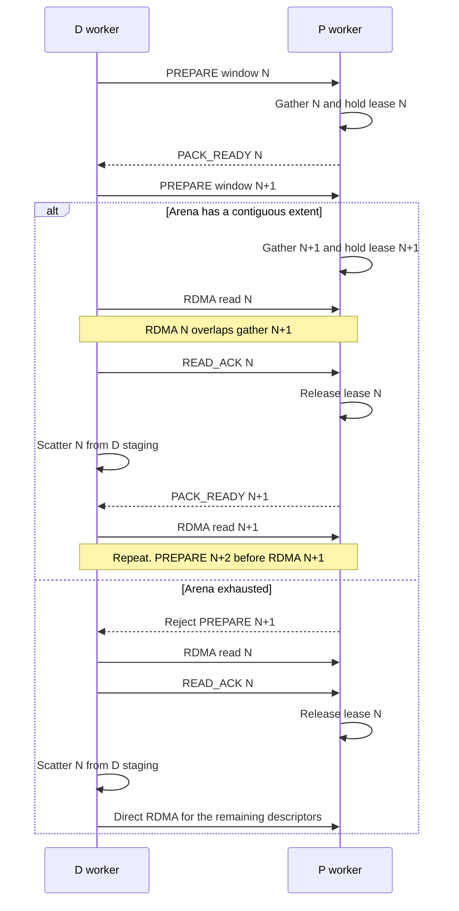

# Mooncake Staging Datapath Optimizations

This document records the next data-path optimizations for Mooncake packed KV
transfers. Items 1 and 2 are implemented on the READ path in
`DecodeStagingCoordinator`. Items 3 and 4 are still proposals.

It is separate from the control-plane round-trip proposal in
[Mooncake Staging Optimization Proposal](mooncake_staging_optimization.md).
The allocator and lease rules in
[Mooncake Staging Allocator](mooncake_staging_allocator.md) still apply.
In particular, a worker must not reclaim a lease after an uncertain timeout
while an already-issued DMA may still write that extent.

## Current Hold Time

One staging window is serial:

```text
D allocate lease
    -> PREPARE_READ_BATCH
    -> P gather, holding the P lease
    -> PACK_READY
    -> D RDMA read
    -> D scatter
    -> READ_ACK
    -> P releases the lease
    -> next window may start
```

The P lease is held from gather until ACK. That interval includes D RDMA and
D scatter, even though scatter reads only the D-side staging extent. Windows
do not overlap. If either side cannot allocate a contiguous extent, the
transfer fails. There is no retry and no fallback to direct RDMA.

With the baseline settings of a 512 MiB arena and 64 MiB chunks, one P worker
holds about eight chunks. A window of four chunks, held through scatter and
ACK, leaves room for about two concurrent D requests on that worker.

## Priority

Do these in order. Later items assume the earlier failure and occupancy
problems are already handled.

### 1. Release the P Lease after RDMA

Send `READ_ACK` as soon as the RDMA read succeeds, then scatter on D. Scatter
copies from the D staging extent into the D KV cache. It does not read the P
extent, so it must not keep the P lease.

This is the smallest change and directly shortens P arena occupancy. D still
holds its own lease until scatter finishes.

Do not split the ACK into a best-effort early release without a completion
check. Release only after the Transfer Engine reports the read complete.

### 2. Fall Back to Direct when the Arena Is Exhausted

This is more important than window pipelining. Pipelining only helps a
request that already obtained staging extents. An allocation failure fails
the whole transfer, so those requests never reach the pipeline.

When P has no contiguous extent for a `PREPARE_READ` or
`PREPARE_READ_BATCH`, reject that prepare and let D send the remaining
descriptors with direct RDMA. Do not fail the request solely because the
staging arena is full or fragmented. The same fallback applies if D cannot
allocate its local destination extent.

Do not add a timeout that forcibly reclaims an active lease. An old ACK must
still be rejected by lease ID, and an in-flight DMA must not observe a reused
extent. Admission control and direct fallback are the safe response to
contention. A fixed-size slab for full 64 MiB chunks can be added later if
first-fit fragmentation is what causes the miss; it is not a substitute for
the fallback.

### 3. Pipeline Staging Windows

While D performs RDMA for window N, P should gather window N+1. The number of
in-flight chunks must stay within the arena. Two full windows of four 64 MiB
chunks are 512 MiB, which fills the baseline arena. Either reduce the window
from 4 to 2, or raise the arena capacity, before enabling a full two-window
pipeline.

The pipeline starts only after item 2 is in place. If the next prepare cannot
allocate, D falls back to direct for the remaining descriptors instead of
aborting the transfer.

`batch_transfer_sync_read` blocks the D thread, so D must send
`PREPARE_READ` for window N+1 before entering the RDMA call for window N.
P then gathers N+1 while that read runs. After the read completes, D sends
`READ_ACK` for N, P releases lease N, and D scatters N locally. Scatter can
overlap the tail of gather N+1, but it does not overlap another RDMA on the
same D thread.



### 4. Submit Direct Runs Independently

Descriptors at or above `min_direct_size` should be submitted as direct RDMA
as soon as planning finishes. They must not wait for the first packed window
to finish gathering.

`release_source_when_ready` stays limited to plans that contain only packed
staging chunks. A mixed plan still has direct reads of P KV blocks, so those
source blocks cannot be released after gather. Do not weaken that rule to
make this overlap.

## Measure before Tuning Thresholds

`VLLM_ASCEND_STAGING_MIN_DIRECT_SIZE` and
`VLLM_ASCEND_STAGING_V1_MAX_PROMPT_TOKENS` are coarse switches. Do not retune
them until the existing timing logs show how gather, RDMA, and scatter
compare for the target workload. Staging pays for two extra device-to-device
copies. It is useful only when packing many small descriptors is cheaper than
issuing those descriptors as direct RDMA.

## Not in This Proposal

- Do not move planning or gather into the four-level address walk in
  `_transfer_kv_cache_all_groups`. That walk only builds descriptors. Gather
  runs on P after a chunk is closed, and the walk is small relative to gather
  and RDMA.
- Do not treat planner contiguous merging as a win on the connector path.
  `spans_from_flat_entries` gives each descriptor its own `component_idx`, so
  the planner will not merge runs that the connector already grouped.
- Do not reclaim a lease on timeout. That is unchanged from the allocator
  design.
